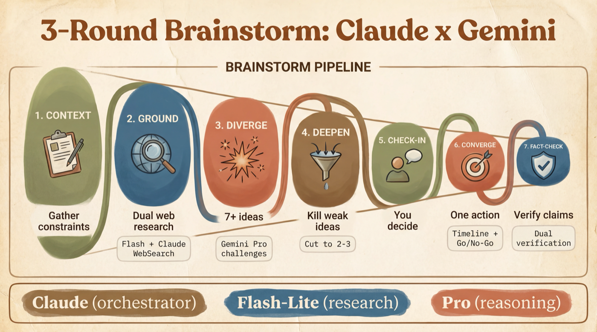

<div align="center">



# skill-brainstorm

**Two AI models argue so you don't have to. One idea in, one decision out.**

*Claude runs the show. Gemini pushes back. Facts get checked. You pick the winner.*


</div>

---

## The Problem

You have an idea and need to make a decision. You ask one AI -- it agrees with you. You ask another -- it also agrees. Everyone's polite, nobody challenges anything, and you ship something based on vibes.

**This skill fixes that.** It runs a structured 3-round adversarial dialogue between Claude and Gemini. Ideas get challenged, weak ones get killed, facts get verified. You end up with one concrete action -- not a list of "options to consider."

---

## How It Works (Plain English)

Think of it as a board meeting between two opinionated experts:

| Step | What Happens | You See |
|------|-------------|---------|
| **Context** | You describe what you're building and your constraints | Claude asks clarifying questions if needed |
| **Research** | Both Claude and Gemini search the web in parallel to verify current facts | A "Verified Context" block with real data |
| **Round 1: Diverge** | Gemini challenges your framing and proposes 5-7 alternative angles | New ideas you hadn't considered |
| **Round 2: Deepen** | Claude kills the weak ideas with evidence. Gemini defends or concedes | The field narrows from 7 to 2-3 survivors |
| **Check-in** | You're asked: "Which direction do you prefer?" | Your input before the final round |
| **Round 3: Converge** | One winner is chosen with a timeline and success criteria | A single action, not a strategy deck |
| **Fact-check** | All claims in the final decision are verified against the live web | A confidence table (confirmed/conflict/incorrect) |

The whole process takes 3-5 minutes and costs about $0.35 in API calls.

---

## Install

**Claude Code (recommended):**
```
/install github:awrshift/skill-brainstorm
```

**Manual:**
```bash
mkdir -p .claude/skills/brainstorm/scripts
curl -sL https://raw.githubusercontent.com/awrshift/skill-brainstorm/main/SKILL.md \
  -o .claude/skills/brainstorm/SKILL.md
curl -sL https://raw.githubusercontent.com/awrshift/skill-brainstorm/main/scripts/gemini.py \
  -o .claude/skills/brainstorm/scripts/gemini.py
```

## Requirements

| What | Why | How to Get |
|------|-----|-----------|
| Google API Key | Powers the Gemini calls | Free at [aistudio.google.com](https://aistudio.google.com) |
| `google-genai` package | Python SDK for Gemini | `pip install google-genai` |
| Claude Code | Orchestrates the brainstorm | You're probably already using it |

Add your key to a `.env` file in your project:
```
GOOGLE_API_KEY=your-key-here
```

---

## When to Use

Just say any of these to Claude:

- *"Brainstorm how to launch X"*
- *"Let's think through options for Y"*
- *"I need to decide between A and B"*
- *"Explore this idea with Gemini"*
- *"Diverge and converge on this"*

The skill triggers automatically. No special commands needed.

---

## Architecture

The skill uses a **two-layer model split** -- a cheaper model handles research, an expensive model handles reasoning:

```
              Claude (orchestrator)
                 |         |
    Research     |         |     Reasoning
    phases       |         |     rounds
                 v         v
          Flash-Lite        Pro
       (web search,      (critical thinking,
        fact-check)       argumentation)
                 |              ^
                 +--Verified----+
                    Context
```

**Why two layers?** When one model does both searching AND thinking, it wastes expensive reasoning capacity on simple lookups like "what version is React?" Splitting the work means:

- **Flash-Lite** -- searches the web, verifies facts, checks claims
- **Pro** -- all brainpower goes to challenging ideas, finding blind spots, building arguments

---

## What You Get at the End

Every brainstorm produces:

1. **One concrete action** -- not 5 options, one thing to do next
2. **A timeline** -- hours or days, not vague "weeks"
3. **Go/no-go criteria** -- "if X doesn't happen by Y, abandon this"
4. **Kill list** -- everything that was considered and why it was rejected
5. **Fact-check table** -- which claims were verified, which had conflicts
6. **The full journey** -- 7+ ideas narrowed to 3, then to 1

---

## Gemini API Cost

Each brainstorm makes 5-6 Gemini API calls. Actual cost depends on how long your prompts and responses are. Here are the per-million-token rates so you can estimate:

| Model | Role in Brainstorm | Calls | Input / 1M tokens | Output / 1M tokens |
|-------|-------------------|-------|-------------------|-------------------|
| Flash-Lite (`gemini-3.1-flash-lite-preview`) | Research + fact-check | 2-3 | $0.25 | $1.50 |
| Pro (`gemini-3.1-pro-preview`) | 3 reasoning rounds | 3 | $2.00 | $12.00 |

Claude orchestration is included in your Claude Code session -- no extra cost.

A typical brainstorm uses roughly 5-15K tokens per Gemini call. Pricing source: [ai.google.dev/gemini-api/docs/pricing](https://ai.google.dev/gemini-api/docs/pricing)

---

## Example Output

After a brainstorm about choosing a payment provider, you'd see something like:

> **Winner:** Stripe Payment Links (not full Checkout integration)
>
> **Why it won:** Zero backend code needed. Embed in landing page today. Upgrade to full Checkout only if conversion > 2%. Lemon Squeezy killed in R2 (no webhook reliability data). Paddle killed in R1 (EU-only tax handling, you need global).
>
> **Timeline:** 2 hours to first payment link. 1 day to embed + test.
>
> **Go/no-go:** If < 10 payments in first week, switch to direct Stripe Checkout.
>
> **Fact-check:** 5/5 claims confirmed (Stripe pricing, Paddle EU limitation, Lemon Squeezy webhook issues).

---

## Gotchas

- **Requires `GOOGLE_API_KEY`** -- without it, Gemini calls fail silently
- **Package is `google-genai`** not `google-generativeai` -- the SDK was renamed
- **User check-in after Round 2 is mandatory** -- prevents the models from converging on something you don't care about
- **Works for any decision** -- not just technical. Hiring, marketing, product strategy, architecture

---

## Part of the AWRSHIFT Ecosystem

| Skill | What It Does |
|-------|-------------|
| **[skill-brainstorm](https://github.com/awrshift/skill-brainstorm)** | You're here. 3-round adversarial brainstorm |
| [skill-gemini](https://github.com/awrshift/skill-gemini) | Gemini inside Claude Code -- ask, ground, image, review |
| [skill-awrshift](https://github.com/awrshift/skill-awrshift) | Adaptive decision framework (Quick / Standard / Scientific) |
| [skill-telegram](https://github.com/awrshift/skill-telegram) | Telegram: read, parse channels, voice notes |
| [claude-starter-kit](https://github.com/awrshift/claude-starter-kit) | All skills pre-configured + project template |

---

## Contributing

1. Fork the repository
2. Create a feature branch
3. Submit a pull request

## License

MIT -- see [LICENSE](LICENSE) for details.

---

<div align="center">
<em>One idea in. One decision out.</em>
</div>
